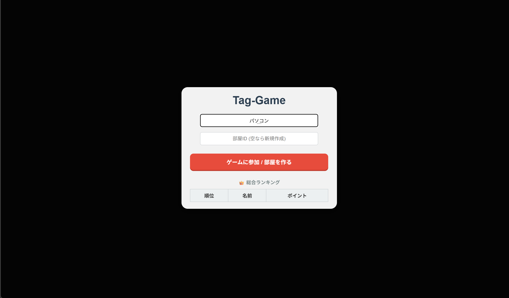
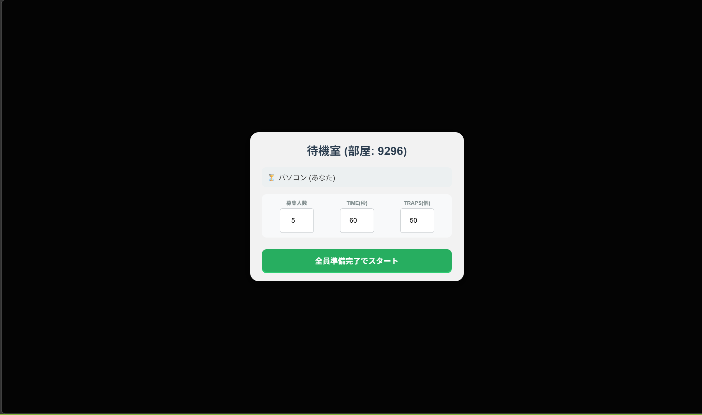

# Online_Tag_Game

ブラウザで動作するリアルタイム多人数オンライン鬼ごっこゲームです。  
WebSocketを使ってプレイヤー間の動きをリアルタイム同期し、スマートフォン・PCどちらからでも楽しくプレイできます。

---

## スクリーンショット






---

## 目次

1. [技術スタック](#1-技術スタック)
2. [システム構成](#2-システム構成)
3. [機能詳細](#3-機能詳細)
4. [ゲームフロー](#4-ゲームフロー)
5. [実行方法](#5-実行方法)
6. [開発の流れ](#6-開発の流れ)
7. [バグ修正の記録](#7-バグ修正の記録)
8. [今後の改善案](#8-今後の改善案)
9. [開発の感想](#9-開発の感想)

---

## 1. 技術スタック

| レイヤー | 技術 | 採用理由 |
|---|---|---|
| フロントエンド | TypeScript + Vite | JavaScriptを学んだ後、型安全性や静的解析といったTypeScriptのメリットを実際のプロダクトで比較・検証しながら習得するために採用 |
| バックエンド | Go (gorilla/websocket) | 以前のSocket通信システム開発でGoのgoroutineによる並行処理を学んでおり、さらに実践を積むために採用。部屋ごとのゲームループとクライアント管理をgoroutineで並行実行している |
| データベース | JSON ファイル | ランキングの永続化のみが目的のためRDBは不要と判断。`sync.Mutex` でgoroutine間の書き込み競合を防いでいる |
| インフラ | Docker + devtunnel | Dockerでコンテナ化して環境差異をなくし、devtunnelでlocalhostをHTTPS公開することで外部から接続を無料で可能にしている |

---

## 2. システム構成

```
[ブラウザ (TypeScript / Canvas API)]
        |
        |  WebSocket (ws:// / wss://)
        |  REST GET /api/ranking
        v
[Go サーバー :8080]
  ├── handleConnections()  -- 1接続 = 1 goroutine
  ├── gameLoop(room)       -- 1部屋 = 1 goroutine（約30fps + 1秒タイマー）
  ├── updateGame()         -- タグ判定 / トラップ判定 / ボット AI
  ├── broadcastGame()      -- 全クライアントへゲーム状態を送信
  └── /api/ranking         -- ランキング JSON を返却
        |
        v
[database.json]  -- ゲーム終了時にポイントを追記・保存
```

### 排他制御の設計

`sync.Mutex`を2層に分けて競合を防いでいます。

- `g.mu` —プレイヤー・オブジェクト・ゲーム状態の読み書きを保護
- `g.clientsMu` — WebSocket接続マップの読み書きを保護

---

## 3. 機能詳細

### 3-1. 部屋システム

- 部屋ID（4桁の数字）でロビーを作成・参加できる
- 部屋IDを空欄にすると、サーバーがランダムな4桁IDを自動発行して新規作成する
- 部屋IDを共有すれば、異なるデバイス・ネットワーク間でも同じ部屋に入れる
- 他者がゲーム中の部屋番号は指定できないようになっている

### 3-2. ゲーム中の乱入禁止

ゲームが `running` 状態の部屋への参加リクエストをサーバー側でブロックし、エラーメッセージを返して接続を拒否します。  
ゲーム終了後（`finished` 状態）に新規プレイヤーが接続した場合は、その部屋をロビー状態に自動リセットします。

### 3-3. ボット（NPC）の自動補充

全員の準備が完了した時点で参加人数が目標に満たない場合、次の手順でボットを補充します。

1. 全人間プレイヤーに「NPC を追加してよいか」の確認モーダルを送信する
2. 全員が同意した場合のみ`NPC-A, NPC-B, …`と命名されたボットを追加してゲームを開始する
3. 1 人でもキャンセルした場合、全員の準備状態をリセットして待機に戻る

ボットは役割によって切り替わります。

- **鬼ボット** — 全プレイヤーの中で最も近い非鬼プレイヤーを直線追跡する
- **逃げボット** — 鬼が半径300以内に接近した場合のみ逆方向に回避する（それ以外は静止）

### 3-4. デバイス間の公平なフィールド

フィールドは仮想座標**1000×1000**の固定サイズで定義されており、表示時に以下のスケール値を乗算して描画します。

```
scale = Math.min(screenWidth, screenHeight) / 1000
```

これにより、スマートフォンやPCでも同じ有効エリアでプレイでき、画面サイズによる有利・不利が生じません。

### 3-5. トラップ

フィールドにランダム配置されたトラップを踏むと状態異常が発生します。踏んだトラップはフィールドから削除されます。

| 種類 | 外見 | 効果 | 継続時間 |
|---|---|---|---|
| 拘束罠 | 黄色の星形 | 移動が停止する | 5秒 |
| 暗転罠 | 紫色の円 | 視界が自分の周囲120pxに限定される | 5秒 |

### 3-6. 障害物

- ゲーム開始時にフィールドへランダムに 灰色の円が8個配置される
- プレイヤーは障害物に進入できず、接触した場合はサーバー・クライアントの双方で押し戻し処理を行う

### 3-7. タグと無敵時間

タグ後の鬼返しを防ぐため、タグ発生時に鬼・新鬼の双方に **5秒間の無敵時間** を付与します。  
ゲーム開始直後も、全プレイヤーに **3秒間の無敵時間** があります。

### 3-8. ポイントとランキング

ゲーム終了時にポイントが集計され`database.json`に永続化されます。ボットはポイント対象外です。

| 結果 | ポイント変動 |
|---|---|
| 逃げ切り成功 | +10 pt |
| 鬼のまま終了 | -5 pt |

ホーム画面にはすべてのプレイヤーの累計ポイントランキングが表示されます。

---

## 4. ゲームフロー

```
[ホーム画面]
  プレイヤー名・部屋 ID を入力 → 「参加 / 部屋を作る」
        |
        v
[ロビー]
  全員が「準備完了」ボタンを押す
        |
        ├── 参加人数 >= 目標人数   → ゲーム開始
        |
        └── 参加人数 < 目標人数   → NPC 補充の確認モーダル
                全員同意         → ボット追加 → ゲーム開始
                キャンセル       → 全員の準備状態をリセット → 待機
        |
        v
[ゲーム中]
  ランダムに 1 人が「鬼」に選出される（赤色）
  マウス / タッチ操作で移動する
  鬼が逃げ役に 30px 以内に接近 → タグ発生・鬼交代
  トラップを踏む              → スタン / 暗転の状態異常が発生
  タイムアップ                → ゲーム終了
        |
        v
[結果画面]
  勝敗・ポイント変動を表示
  「ホームへ戻る」でランキングを更新して初期画面へ
```

---

## 5. 実行方法

### 前提条件

- [Docker](https://www.docker.com/) がインストール済みであること
- [devtunnel](https://learn.microsoft.com/ja-jp/azure/developer/dev-tunnels/get-started) がインストール・ログイン済みであること

### 手順

```bash
#1. プロジェクトディレクトリに移動
cd Online_Tag_game
#2.　docker起動（インストール環境などによって若干の違いあり）
docker compose up
#3. devtunnel で外部公開
devtunnelでポート番号5173と8080を設定し、発行されたURL(~.devtunnels.ms)を参加者に共有する
```
(devtunnelを使用すると、フロントエンドは`~.devtunnels.ms`ドメインを自動検出し、WebSocket接続先を`wss://xxx-8080.devtunnels.ms/ws`へ切り替えます。ランキングAPIのURLも同様に自動補正されます。

---

## 6. 開発の流れ

1. 仕様書とコードの要所のイメージ（構造・フロー）をドキュメントとして整理する
2. Gemini Pro に実装を依頼し、ベースコードを生成する
3. バグ修正・機能追加を手動で実施する（詳細は[バグ修正の記録](#7-バグ修正の記録)を参照）
4. 最終コードを Claude に渡し、日本語コメントを付与する

---

## 7. バグ修正の記録

### #01 — プレイ中のフィールドに部屋番号にアクセスし参加できてしまう

**バグ**  
`running`状態の部屋でも部屋番号を指定すれば新規プレイヤーが接続できてしまい、ゲーム終了の1秒前に参加しても勝ちと判定されてしまった。

**原因**  
接続ハンドラがゲームの進行状態を確認せずにプレイヤーを追加していた。

**対応**  
`handleConnections` の先頭で `g.Status == "running"` を判定し、進行中であればメッセージを示して排他制御し、参加を認めないように変更した。

---

### #02 — 準備解除後にNPC同意フラグが残留する

**バグ**  
NPC追加に同意した後、準備ボタンを押し直して再度準備完了にすると、前回の同意フラグが残ったまま全員同意の条件を満たしてしまい、意図せずNPCが追加されゲームが開始されることがあった。

**原因**  
`toggle_ready`で準備状態を解除しても`NpcApproved`フラグがリセットされていなかった。

**対応**  
`toggle_ready`の処理内で準備解除（`IsReady = false`）と同時に `NpcApproved = false` もリセットするように修正した。

---

### #03 — 目標人数を参加人数より少なく設定できてしまう

**バグ**  
ロビーの「募集人数」設定値を現在の参加者数より小さい値に変更できてしまい、部屋にいたのに参加できないプレイヤーが発生したり、ゲームが即座に開始されたり、ボット補充の条件判定がおかしくなったりすることがあった。

**原因**  
フロントエンドとサーバーの双方で、最小値の下限チェックが実装されていなかった。

**対応**

- フロントエンド —`lobbyTarget`の`input`要素の`min`属性を現在の人間プレイヤー数で動的に更新するようにした。また、`change`イベントで`min`を下回った場合は最小値に補正してからサーバーへ送信するようにした。
- バックエンド —`adjustTargetPlayers()`を実装し`TargetPlayers`が人間プレイヤー数・最低2人を下回らないよう補正するようにした。この関数はプレイヤーの参加・退出・設定変更のタイミングで必ず呼び出している。

---

### #04 — 障害物の押し戻し処理でゼロ除算が発生する

**バグ**  
プレイヤーが障害物の中心座標と完全に重なることができてしまい、更にゲームが異常終了することがあった。

**原因**  
押し戻し処理で方向ベクトルを`dist` で除算していたが、重なり合った際に`dist == 0`になり、ゼロ除算となるケースを考慮していなかった。

**対応**  
`dist == 0`の場合にランダムな微小ベクトルを付与することで、ゼロ除算を回避しつつ安全な方向に押し戻せるようにした。

---

### #05 — スマートフォンのタッチ操作でページスクロールが発生する

**バグ**  
スマートフォンでゲーム中にスワイプ操作をするとキャラクターが動かず、ページがスクロールされてしまうことがあった。

**原因**  
`touchmove`イベントのデフォルト動作がキャンセルされていなかった。

**対応**  
`touchstart`と`touchmove`のイベントリスナーに `{ passive: false }` オプションを設定したうえで `e.preventDefault()` を明示的に呼び出すことでスクロールを抑制した。

---

## 8. 今後の改善案

### UI の改善

現状はキャラクターが単色の円のみで、ゲーム中に自分のアイコンを黒枠でしか識別できない。以下の改善を検討している。

- プレイヤーごとに形・番号・模様を割り当てて固有性を出す
- プレイヤー名をキャンバス上に表示する
- タグ発生時・トラップ踏み時にエフェクトを追加してゲーム感を向上させる

### ゲームプレイの拡張

- トラップの種類を増やす（速度低下・テレポートなど）
- ランキングのリセット機能を追加する
- コインなどの得点要素を追加する


## 9. 開発の感想
TSは直接TSとしてコンパイルされると考えていたが、途中でJSに変換されていると知り驚いた。並列処理や排他制御のコードを実際に読み書きし、Goの学習になった。

また、生成AIのコーディング力の高さに驚くとともに、以前自然言語の指示だけではうまく解決できないバグなどにも出会い、バグシューティングの重要さを感じた。

今度は更に映像負荷の高いスプラトゥーンのようなゲームを実装してみたい。
